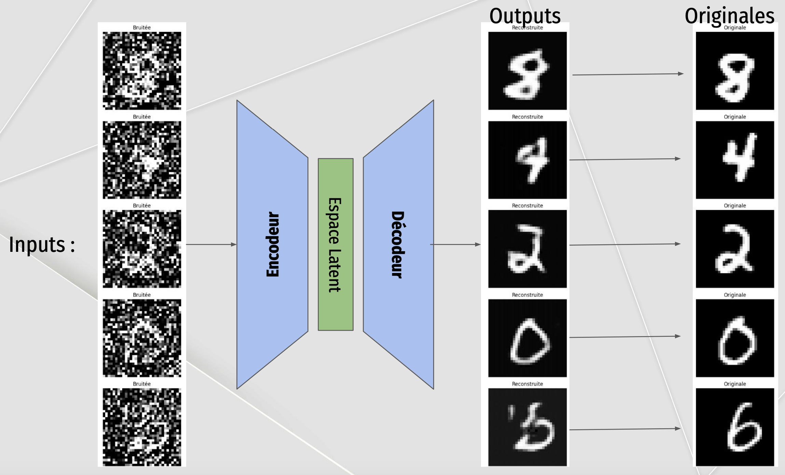
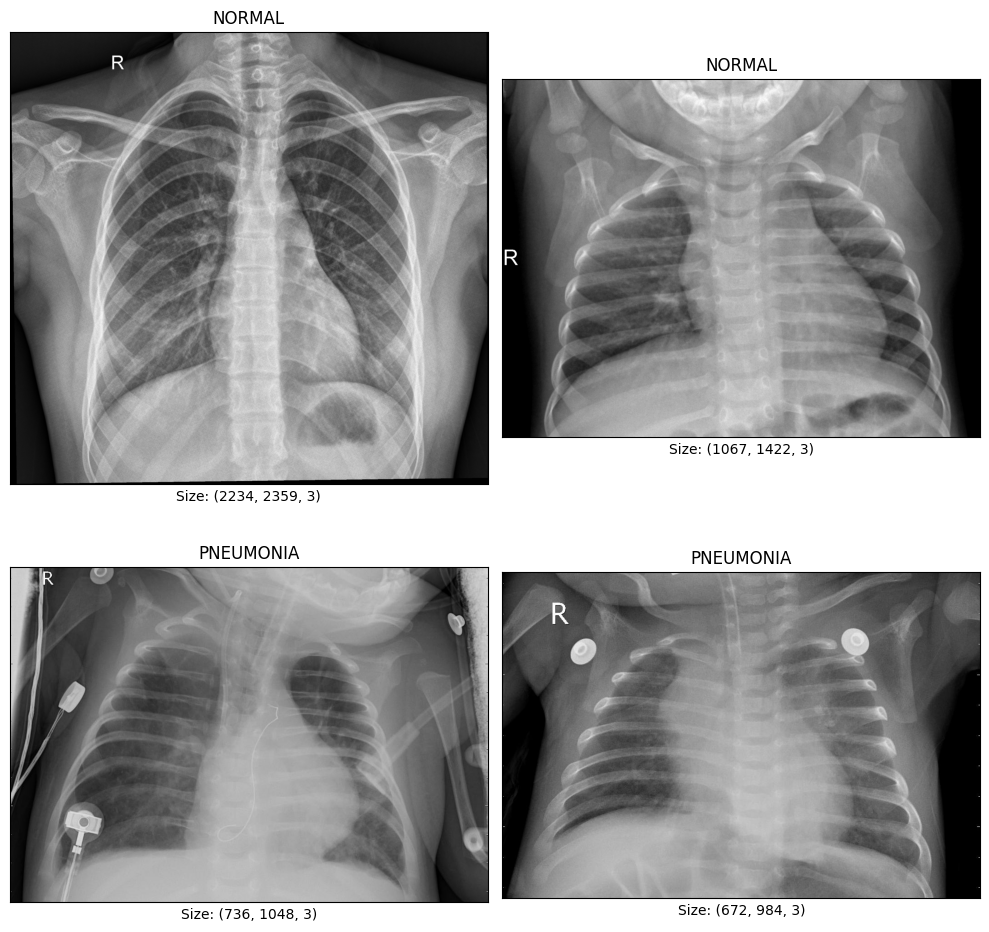
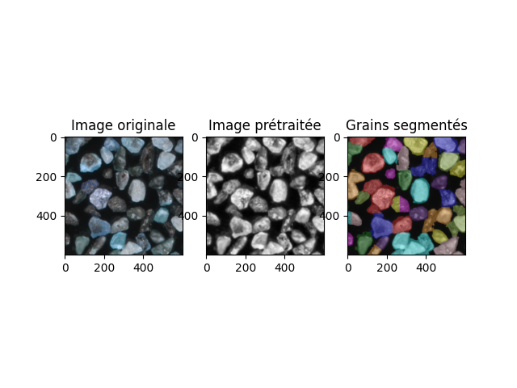

# **Projets de Vision Artificielle (8INF804)**  
  
  
  

Ce dépôt présente quatre projets réalisés dans le cadre du cours Vision Artificielle (8INF804) à l’UQAC. Chaque projet explore des concepts clés de la vision par ordinateur, et un rapport détaillé est disponible pour chaque projet, offrant une description approfondie des méthodologies et résultats. Voici une brève présentation de ces projets :
1. Auto-encodeur Débruiteur : Ce projet propose un auto-encodeur conçu pour débruiter des images. Il permet d'améliorer les performances des modèles de classification en éliminant le bruit présent dans les images.
2.	Détection de Pneumonie par CNN et Transfert Learning d'un modèle ResNet50 : Ce projet utilise des réseaux de neurones convolutifs (CNN) et le transfert learning pour classer des radiographies thoraciques en deux catégories : pneumonie ou normal.
3.	Segmentation d’Images Microscopiques : Ce projet applique des techniques de segmentation, notamment l’algorithme Watershed, pour extraire et analyser les grains dans des images microscopiques, facilitant ainsi leur classification.
4.	Détection des Changements dans des Scènes Intérieures : Ce projet se concentre sur la détection d’objets déplacés dans des scènes intérieures en utilisant des techniques de traitement d’images avancées, permettant de repérer et d’isoler les changements pertinents dans un environnement donné.
---

## **Contenu du dépôt**  

### Projet n°1 : **Auto-Encodeur Débruiteur**  
  
- **Description** : Développement d’un auto-encodeur basé sur des CNN pour débruiter des images du dataset MNIST et améliorer la performance d’un modèle de classification.  
- **Points clés** :
  - Compréhension théorique des auto-encodeurs.     
  - Extraction de caractéristiques à partir de l’espace latent.  
  - Comparaison de fonctions de perte (MSE, L1, SmoothL1).  
  - Résilience testée face à différents types de bruit (Poisson, Speckle, périodique).  
- **Compétences** : PyTorch, auto-encodeurs, traitement de bruit.  
- [Dossier du projet](./Auto-encodeur)  

---

### Projet n°2 : **Détection de Pneumonie par CNN et Transfert Learning**  
  
- **Description** : Ce projet compare les performances d’un modèle CNN entraîné de zéro et d’un modèle pré-entraîné (ResNet50) pour la détection de pneumonie à partir de radiographies thoraciques.  
- **Points clés** :  
  - Fine-tuning de ResNet50 pour une tâche de classification binaire.
  - Création et entrainement d'un CNN.
  - Analyse approfondie des performances (F1-score, matrice de confusion).  
  - Gestion des données déséquilibrées.  
- **Compétences** : PyTorch, transfert learning, vision médicale.  
- [Dossier du projet](./TransfertLearning_ResNet50)  

---

### Projet n°3 : **Analyse et Segmentation d’Images Microscopiques**  
  
- **Description** : Segmentation et analyse de grains dans des images microscopiques pour extraire des caractéristiques et faciliter leur classification automatique.  
- **Points clés** :  
  - Utilisation de l’algorithme Watershed pour la segmentation.  
  - Prétraitement par CLAHE et analyse des composantes HSV.  
  - Génération de cartes de distance pour identifier les grains.  
- **Compétences** : OpenCV, segmentation d’images, algorithme Watershed.  
- [Dossier du projet](./Segmentation)  

---

### Projet n°4 : **Détection des Changements dans une Scène Intérieure**  
  
- **Description** : Ce projet détecte les objets déplacés ou mal rangés dans des pièces d’un appartement en conditions d’éclairage variées. Les changements pertinents sont mis en valeur à l’aide de bounding boxes.  
- **Points clés** :  
  - Utilisation des espaces de couleur LAB et de l’algorithme CLAHE pour normaliser les images.  
  - Identification des changements par calcul de différence absolue entre les images.  
  - Filtrage des détections pour exclure les faux positifs.
- **Compétences** : OpenCV, traitement d’images, analyse de scènes.  
- [Dossier du projet](./DetectionChangementsScene)  

---

## **Installation et Utilisation**

1. **Cloner le dépôt** :  
Clonez ce dépôt en utilisant la commande suivante : 
```bash
git clone https://github.com/MathisAulagnier/Vision_Artificielle.git
```
2. **Installer les dépendances** :
Installez toutes les dépendances nécessaires avec pip :
```bash
pip install -r requirements.txt
```

3. **Exécuter un projet** : 
Pour lancer un projet, exécutez le fichier principal du projet (généralement main.py) :
```bash
python <nom_dossier_projet>/main.py
```

**Remarque** : Chaque projet contient soit un fichier main.py, soit un notebook Jupyter pour exécuter le code.
Si le projet utilise un notebook Jupyter, vous devrez d’abord installer Jupyter. Voici les commandes pour l’installer et démarrer un notebook :
```bash
pip install jupyter
jupyter notebook
```
___

Mathis Aulagnier
